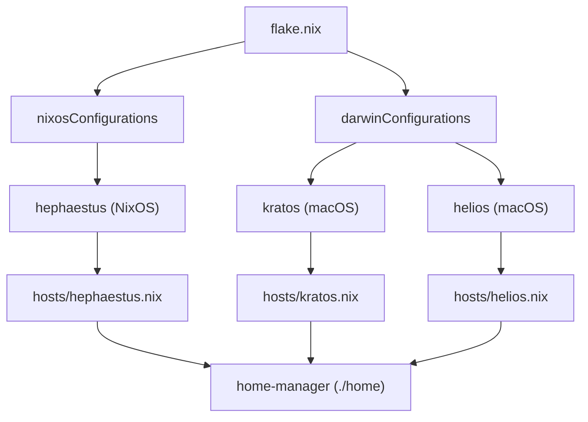

# nix-config

This repo stores nix configuration to manage my hosts running [NixOS](https://nixos.org/) and macOS.

The configuration is very specific to my own machines and setup, but it may be a useful reference for anyone else learning or experimenting with nix, whether it be on a personal workstation or a server environment.



## Prerequisites

- [NixOS](nixos.org) (Linux)
- [Determinate Nix](https://determinate.systems/nix-installer) (macOS)
- [just](https://github.com/casey/just)

## Build

To run a build/rebuild:

```sh
just rebuild
```

## Updates

Updates are proposed by [renovate](https://github.com/renovatebot/renovate). To build the system, checkout the renovate PR and run `just rebuild`.

If the build is stable, run `just merge-pr`.

## Common Recipes

Run `just` to view all recipes and associated descriptions:

```console
❯ just
Available recipes:
    clean                    # run nix garbage collection (user + root)
    fmt                      # format all nix files [alias: f]
    merge-pr                 # squash-merge current branch's PR with nvd diff in body
    rebuild                  # build, show nvd diff, then switch [alias: r]
    rebuild-boot             # rebuild and install bootloader
    rollback                 # switch to previous generation
    update-claude *version   # usage: just update-claude [VERSION]  (VERSION without leading 'v'; defaults to latest)
    update-pi *version       # usage: just update-pi [VERSION]  (VERSION without leading 'v'; defaults to latest)
```

## Restoring from a live USB

If the bootloader for some reason breaks (i.e. motherboard firmware upgrade), restore it from a live USB by running the following commands:

```console
$ sudo cryptsetup luksOpen /dev/nvme0n1p2 crypted-nixos
Enter passphrase for /dev/nvme0n1p2: ********
$ sudo mount /dev/vg/root /mnt
$ sudo mount /dev/nvme0n1p1 /mnt/boot/efi
$ sudo nixos-enter --root /mnt
$ hostname <hostname>
```

Navigate to the nix-config directory and run:

```sh
just rebuild-boot
```
